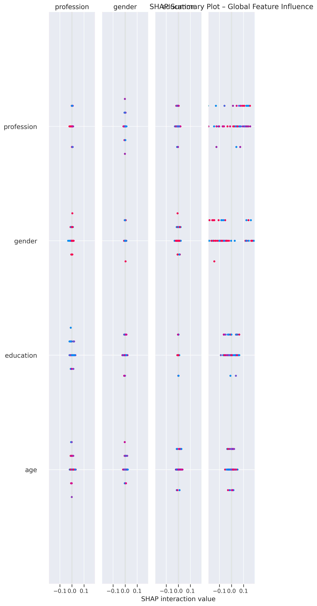
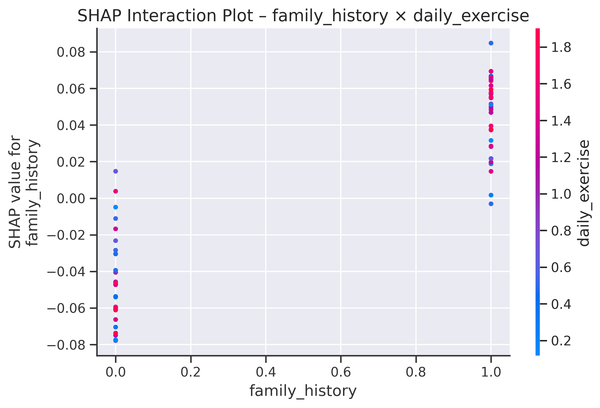
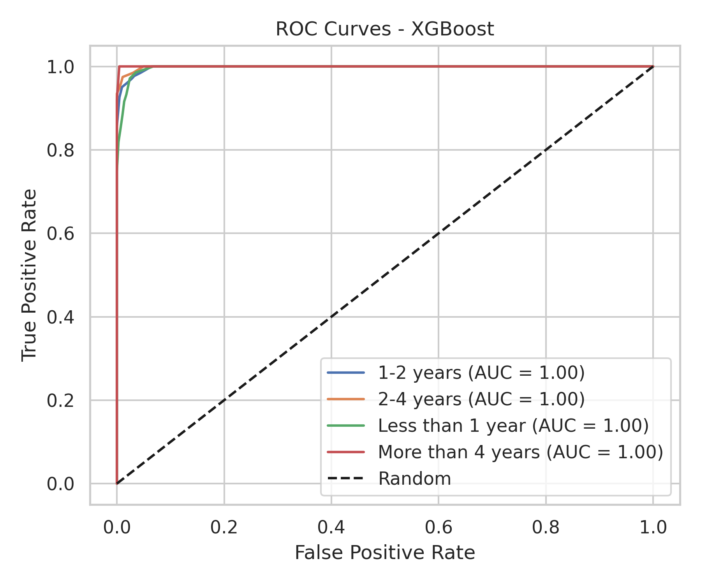
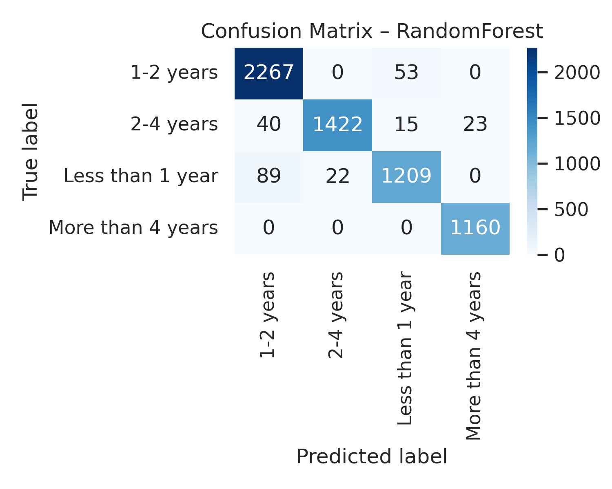

# Predicting Diabetes Risk Through Integrated Lifestyle Patterns
## Community-Based Population Study in Bangladesh

### 📋 Executive Summary
This project analyzes how lifestyle behaviours, health awareness, cognitive misperceptions, family history, and demographic factors jointly influence diabetes risk among adults in Bangladesh. The study involves a dataset of approximately 31,500 adults (2023–2025).

### 🎯 Objectives
1. Assess the relationship between lifestyle behaviours (physical activity, diet) and diabetes risk.
2. Evaluate diabetes awareness and preventive behaviours.
3. Examine the impact of cognitive misperceptions and family history.
4. Identify behavioural-cognitive patterns using ML techniques.

### 🛠 Methodology
*   **Design:** Quantitative cross-sectional study.
*   **Data Source:** Structured 32-item questionnaire (Demographics, Lifestyle, Awareness, Misperceptions).
*   **Analysis:** Descriptive statistics, comparative analyses, and predictive machine-learning models.

### 🔒 Ethics & Data Privacy
This study adheres to strict ethical guidelines. No personally identifiable information (PII) is included in this repository. All data analyzed is anonymized.

# 🏥 Predicting Diabetes Risk: Integrated Lifestyle & Cognitive Patterns
### A Community-Based Population Study in Bangladesh (n=31,500)

## 📋 Executive Summary
This research project employs **Machine Learning** and quantitative statistical methods to examine how lifestyle behaviours, health awareness, cognitive misperceptions, and family history jointly influence diabetes risk among adults in Bangladesh. 

Moving beyond simple biological risk factors, this study integrates **cognitive and behavioral domains** to predict risk and inform public health policy.

---

## 📊 Key Visualizations & Model Performance

### 1. Model Interpretability (XAI)
We utilize **SHAP (SHapley Additive exPlanations)** to understand *why* the model makes specific predictions. This ensures ethical transparency in our medical risk analysis.

| Global Feature Importance | Interaction Analysis |
|:---:|:---:|
|    *Impact of top features on model output* |    *Interaction between key risk factors* |

### 2. Classification Performance
Comparison of machine learning models (XGBoost, Random Forest, SVM, etc.) in predicting diabetes risk levels.

| ROC Curve (XGBoost) | Confusion Matrix (Random Forest) |
|:---:|:---:|
|    *Receiver Operating Characteristic* |    *Prediction Accuracy breakdown* |

> **Note:** Additional plots for MLP, KNN, and Logistic Regression are available in the repository root.

---

## 🎯 Research Objectives
1.  **Lifestyle Analysis:** Assess relationships between physical activity, diet, routine consistency, and diabetes risk.
2.  **Awareness Evaluation:** Measure the gap between health literacy and preventive behaviours.
3.  **Cognitive Misperceptions:** Quantify the impact of myths (e.g., "diabetes is curable via traditional meds") on risk.
4.  **Pattern Recognition:** Use ML to identify behavioural-cognitive clusters for targeted intervention.

---

## 🛠 Methodology

### Study Design
*   **Population:** Adults ≥18 years in Bangladesh.
*   **Sample Size:** ~31,500 participants (2023–2025).
*   **Instrument:** Structured 32-item questionnaire covering Demographics, Lifestyle, Awareness, and Misperceptions.

### Analytical Pipeline
The project follows a rigorous data science pipeline:
1.  **Preprocessing:** Data cleaning, handling missing values, and encoding categorical variables.
2.  **Exploratory Data Analysis (EDA):** PCA and correlation analysis.
3.  **Modeling:** Training `XGBoost`, `Random Forest`, `SVM`, `MLP`, `KNN`, and `Logistic Regression`.
4.  **Evaluation:** Metrics including Accuracy, Precision, Recall, F1-Score, and AUC-ROC.
5.  **Explainability:** LIME and SHAP analysis for individual and global interpretability.

---

## 📂 Repository Structure

### 🧠 Analysis Notebooks
*   `figures.ipynb`: Code used to generate the visualizations and plots.
*   `practice001(classification).ipynb`: Initial classification model experiments.
*   `plabon01.ipynb`: Data preprocessing and feature engineering steps.
*   `300-kaggle.ipynb`: Advanced modeling techniques.

### 📈 Figures & Assets
*   `shap_*.png`: Comprehensive SHAP analysis plots (Summary, Beeswarm, Waterfall).
*   `roc_curves_*.png`: Performance curves for all tested models.
*   `confusion_matrix_*.png`: Error analysis matrices.
*   `pca_*.png`: Principal Component Analysis visualizations.

### 📄 Documentation
*   `Research questiones.docx`: Detailed breakdown of hypotheses.
*   `reserch synopsis.docx`: Full academic proposal.
*   `dataset.csv`: (Anonymized) structured dataset used for analysis.

---

## 🔒 Ethics & Data Privacy
This study adheres to strict ethical guidelines (Helsinki Declaration). 
*   **Anonymity:** No personally identifiable information (PII) is stored in this repository.
*   **Consent:** Data was collected with informed consent.
*   **Usage:** Data is strictly for academic and public health research purposes.

---

## 📚 References
This work is informed by:
*   *Health Belief Model (HBM)*
*   *Theory of Planned Behaviour (TPB)*
*   *Protection Motivation Theory*

---
*Maintained by [MdFahimShahoriar](https://github.com/MdFahimShahoriar)*
